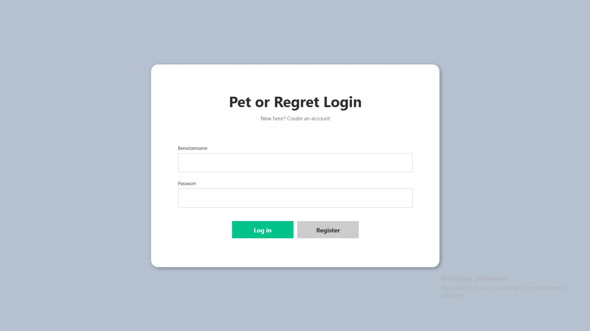
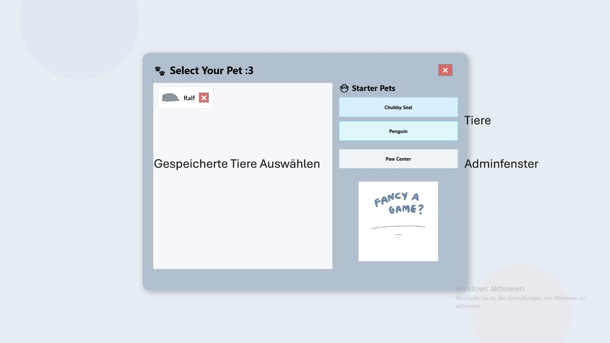
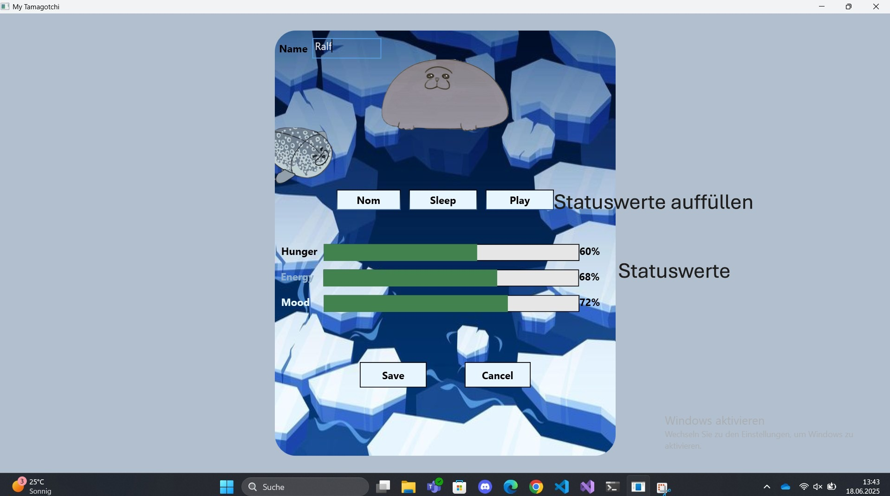
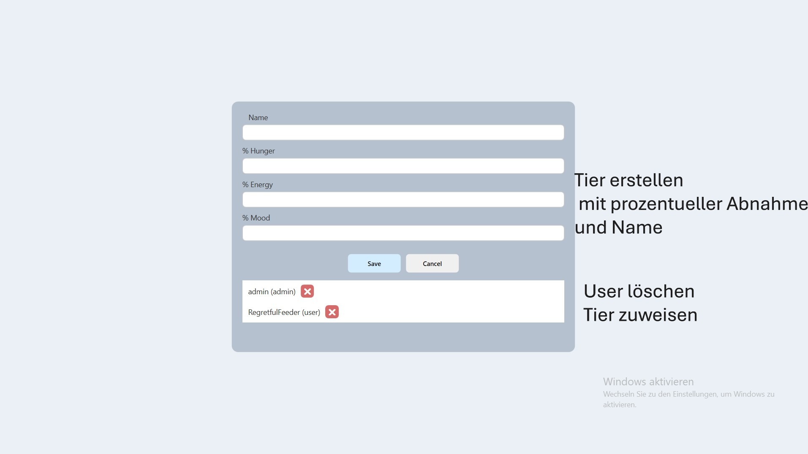

# Projektdokumentation – Pet or Regret - API & Backend

## Projekttagebuch
### Backend
| Name              | Tätigkeit                                                                 |
|-------------------|---------------------------------------------------------------------------|
| Laura Rützler     | Datenbankschema `pets`, `actions` entworfen und implementiert             |
|                   | Dazugehörige Endpoints in `app.py`                                        |
|                   | Swagger-YAML erstellt                                                     |
|                   | Fehlerbehandlung, Feed/Sleep/Play-Logik                                   |
|                   | REST-Schnittstelle mit Frontend verbunden                                 |
| Franziska Greunig | Normalform `users` und Endpoints in `app.py`                              |
|                   | Passwort-Hashing mit bcrypt                                               |
|                   | Swagger-YAML ergänzt                                                      |
|                   | REST-Schnittstelle mit Frontend verbunden für `user`                      |
### Frontend
| Name              | Tätigkeit                                                                 |
|-------------------|---------------------------------------------------------------------------|
| Laura Rützler     | Petlogik, OOP, Foodlogik, MiniGame, Auswahlfenster                             |
| Franziska Greunig | Userlogik, Gameover-Logik, Adminbereich, UnitTests                        |
| Beide             | `PetAPI`, Hauptfenster, Design, Logging, Dokumentation   

## Projektplanung (Lastenheft)

### Ziel
Die Grundidee ist ein digitales Haustier, das wie ein klassisches Tamagotchi überlebt, gepflegt und beobachtet werden kann. Benutzer registrieren sich, erstellen ein eigenes Tier, und können über Aktionen wie Füttern, Spielen und Schlafen den Zustand des Tieres beeinflussen.  
Ziel ist es, das Tier „glücklich“ zu halten. Die Kommunikation erfolgt über eine REST-API mittels JSON.

### Anforderungen

**Funktional:**
- Benutzerregistrierung & Login
- Haustier anlegen, bearbeiten, löschen
- Aktionen: Feed, Sleep, Play
- Statusanzeigen (Hunger, Energie, Stimmung)
- Bildpfade für UI-Darstellung
- REST-API mit Swagger-Doku
- Password Hashing (bcrypt)
- Logging, JSON-Rückgaben, Unitest, OOP, Threads

---

## Umsetzungsdetails

**Backend:**
- Flask (Python)
- REST-Endpunkte für Benutzer & Haustiere
- bcrypt für Passwort-Hashing
- Fehlerbehandlung mit Try/Except

**Datenbank:**
- MariaDB (kompatibel mit MySQL)
- Tabellen: `users`, `pets`, `actions`
- Fremdschlüsselverknüpfung von Haustieren zu Benutzern
- ENUMs zur Wertabsicherung

**Swagger:**
- YAML-Datei beschreibt alle Endpunkte. API-Dokumentation (Datei: `swagger.yml`)

---
## Benutzerverwaltung

**Registrierung:**  
  `POST /auth/register`  
  Neue Benutzer werden registriert. Passwörter werden mit `bcrypt` gehasht und gespeichert.

**Login:**  
  `POST /auth/login`  
  Benutzername und Passwort werden überprüft.

**Benutzer löschen:**  
  `DELETE /users/<id>`  
  Löscht User und alle zugeordneten Haustiere.

---

## Haustierverwaltung

**Haustier erstellen oder aktualisieren:**  
  `POST /pets`  
  Automatisches Update bei gleichem `name` und `ownerid`

**Alle Haustiere abrufen:**  
  `GET /pets`  
  Gibt eine Liste aller Haustiere zurück

**Einzelnes Haustier abrufen:**  
  `GET /pets/<id>`  
  Gibt Tierdaten anhand `petid` zurück

**Haustier bearbeiten:**  
  `PUT /pets/<id>`  
  Werte wie `hunger`, `energy`, `mood`, `imagepath` ändern

**Haustier löschen:**  
  `DELETE /pets/<id>`  
  Entfernt Tier komplett aus der DB

**Bildpfad (imagepath):**  
  Pfad zu UI-Bild (z. B. `/Assets/seal_happy.png`) wird gespeichert

---

## Aktionen

**Füttern:**  
  `POST /pets/<id>/feed`  
  Erhöht Hunger

**Spielen:**  
  `POST /pets/<id>/play`  
  Erhöht Mood

**Schlafen:**  
  `POST /pets/<id>/sleep`  
  Erhöht Energy

---

## Datenbank
- Erstellt über `tamagotchischema.sql`
- Verwendet MySQL
- Tabellenstruktur:
  - `users(userid, username, password, role)`
  - `pets(petid, name, hunger, energy, mood, ownerid, imagepath)`
  - `actions(actionid, petid, actiontype, lastperform)`

**Beispielbenutzer:**
  - `RegretfulFeeder` (user)
  - `admin` (admin) 

**Beispieltiere:**
  - `Chubby Seal`, `Sid`

---

## Softwarevoraussetzungen
| Komponente       | Version        |
|------------------|----------------|
| Python           | 3.11           |
| Flask            | 2.3.3          |
| bcrypt           | 4.1.2          |
| MariaDB          | 11.7 (x64)     |
| .NET             | 8.0            |
| Visual Studio    | 2022           |
| Swagger          | 13.18          |
| REST Client      | Postman        |

---

## Funktionsblöcke / Architektur
**Frontend (WPF)**: GUI zur Steuerung
  - Login/Register
  - Auswahlfenster
  - Hauptfenster (Tamagotchi)
  - Editorfenster (Statusbearbeitung)
**Backend**
   - `app.py`: Enthält alle REST-Endpunkte
   - MariaDB: lokale Datenspeicherung
     - `pets`
     - `users`
     - `actions`

```
[Frontend - WPF]
    |
    |-- Login/Register Window
    |-- Auswahlfenster
    |-- Hauptfenster (Tamagotchi)
    |-- Editorfenster (Status bearbeiten)
        |
        --> REST API (C# Backend)
                |
                --> MariaDB (Users, Pets, Actions)
```

## Testkonzept
- Manuelle Tests über Postman / GUI
- Überprüfung der Datenbankeinträge nach jeder Aktion
  - Werte korrekt aktualisiert?
  - Bildpfad und Besitzerzuordnung korrekt?
  - Keine Duplikate oder fehlerhafte Einträge?

---

## Probleme & Lösungen
 **Bilder nicht geladen:**  
  Nicht als Ressourcen eingebunden. → Bilder als `Resource` markieren, Pfade anpassen.

  **Benutzernamen doppelt möglich:**  
  Kein `UNIQUE` auf `username`. → Datenbank anpassen, Duplikate verhindern.

  **Unsichtbare Elemente bleiben aktiv:**  

---

## Bedienungsanleitung
1. Konsole öffnen. API mit `python app.py` starten. MariaDB muss vorher lokal erstellt werden. Schema in `tamagotchidb`.
2. WPF-Anwendung in Visual Studio starten.
3. Logge dich ein oder registriere einen neuen User.
4. Wähle ein Haustier aus.
5. Nutze Buttons zum Füttern, Spielen, Schlafen. Aktionen beeinflussen die Statuswerte. Die Werte werden durch Healthbars dargestellt.
6. Haustier kann gespeichert und wieder geladen werden. 
7. Im Editorfenster können Werte manuell angepasst werden. Nur als Admin sichtbar.

Genauer Sichtbar ->
---

### Screenshots





---

## Quellen
Images: 
- https://giphy.com/
- https://tenor.com/de-AT/

- https://www.youtube.com/playlist?list=PLReL099Y5nRc-zbaFbf0aNcIamBQujOxP
- https://www.testautomatisierung.org/tutorial-testautomatisierung-unit-tests/