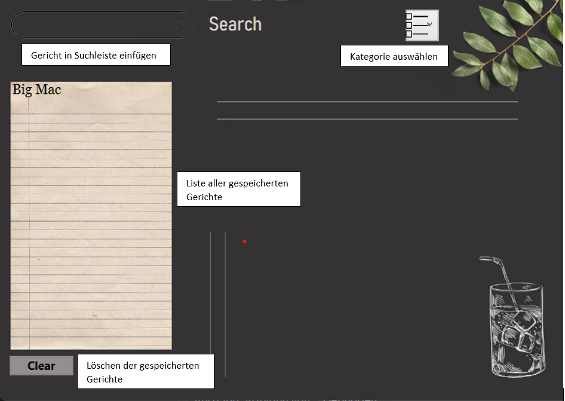
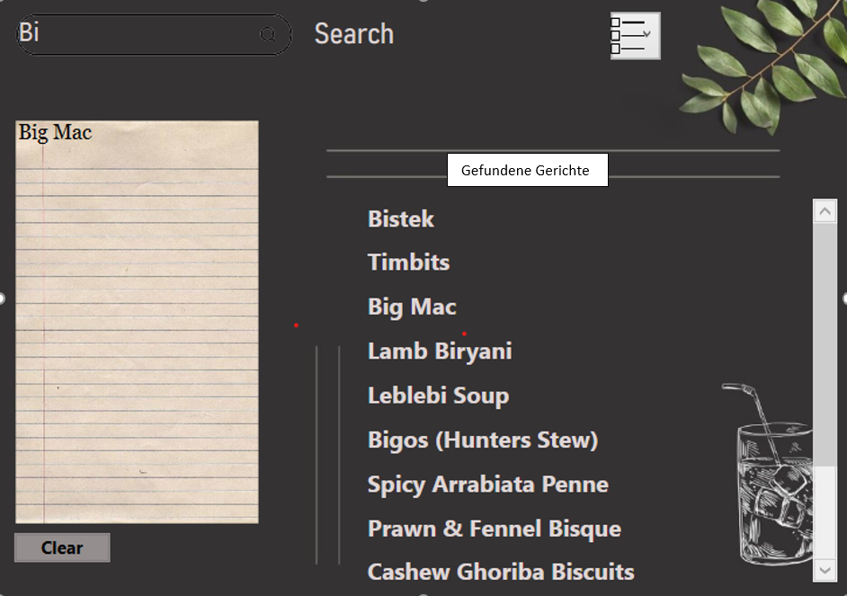
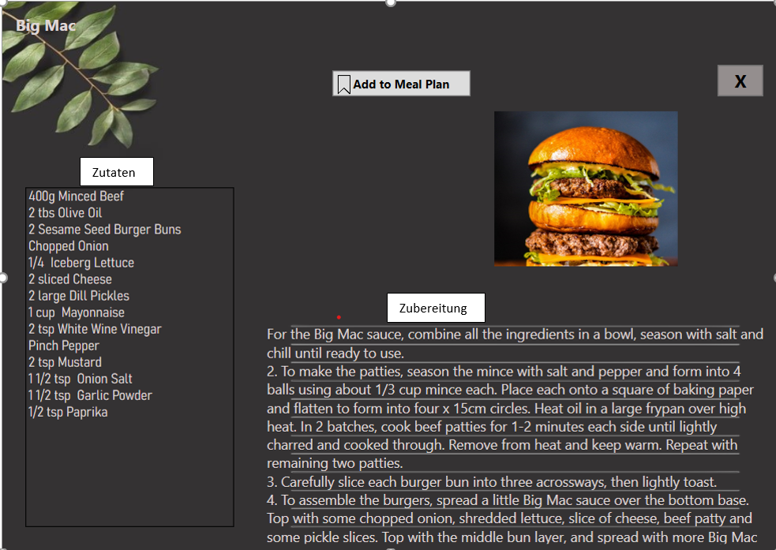

# Dokumentation Rezept-Anwendung

## Team und Projektidee
- **Teammitglieder**: Laura, Franziska
- **Projektidee**: Rezeptanwendung

## Projekttagebuch

| Was wurde gemacht                  | Wann               | Wer        |
|------------------------------------|--------------------|------------|
| Projektidee/Umsetzung überlegen    | 24.04 - 8.5.2024   | Beide      |
| Dokumentation  | 24.04 - 9.6.2024   | Beide      |
| Rezept API "themealdb" implementieren | 08.05 - 09.05.2024 | Laura      |
| GUI Anfang                         | 08.05 - 09.05.2024 | Franziska  |
| GUI Design                             | 09.05 - 08.06.2024             | Franziska     |
| RecipeDetailsWindow                             | 15.05. - 29.05.2024             | Laura     |
| API                             | 15.05 - 17.05.2024             | Franziska     |
| API Änderung                             | 20.05 - 29.05.2024             | Franziska     |
| Recipe Sorter                             | 20.05 - 29.05.2024             | Laura     |
|

## Planungsphase

### Idee
Rezeptanwendung mithilfe einer API

### Mindestanforderungen
- Benutzeroberfläche
- API mit Rezepten
- Suchfunktion mit Filter
- Detailansicht für Rezepte
- Einkaufsliste

### Nice-to-have
- Kochplaner
- Bewertungen

### Umsetzung

#### Benutzeroberfläche
- **Startseite**: Sucheingabe für die Rezepte, Filter um nach bestimmten Rezepten zu filtern, Optionen zum Anzeigen von gespeicherten Rezepten, Hinzufügen neuer Rezepte und Suchen nach Rezepten.
- **Detailseiten**: Anzeigen einzelner Rezepte mit Details wie Zutatenliste und Anleitung.

#### Datenbank
- **Rezept**: Enthält Informationen wie Titel, Zutatenliste, Anleitung, Schwierigkeitsgrad, Bewertungen usw.
- **Zutat**: Enthält Informationen über einzelne Zutaten, die in Rezepten verwendet werden.
- **Kategorie**: Ermöglicht die Kategorisierung von Rezepten (z.B. Vorspeisen, Hauptgerichte, Desserts).

#### Backend-Logik
- Funktionen zum Hinzufügen, Bearbeiten und Löschen von Rezepten.
- Suchfunktionen, um Rezepte basierend auf Titel, Zutaten oder Kategorien zu finden.

#### Frontend-Implementierung
- Verwendet WPF-Elemente wie Fenster, Seiten, Navigationsleisten, Textfelder, Listenansichten usw., um die Benutzeroberfläche zu erstellen.
- Datenbindung, um die Anzeige von Rezepten und anderen Informationen aus der Datenbank zu ermöglichen.

## Aufbau

### Aufbau der GUI

Die GUI besteht aus mehreren Komponenten, die in einer Grid-Struktur angeordnet sind:
- Eine **Suchleiste** mit einem Textfeld und einem Suchbutton.
- Eine **ListBox**, die die Suchergebnisse anzeigt.
- Eine **ComboBox** für die Auswahl der Rezeptkategorie.
- Ein **Textfeld**, das den aktuellen Essensplan anzeigt.

### Aufbau des Programms

Das Programm besteht aus mehreren Klassen und Dateien:

- **MainWindow.xaml** und **MainWindow.xaml.cs**: Enthalten die Hauptlogik der Anwendung, einschließlich der Benutzeroberfläche und der Interaktionen.
- **Recipe.cs**: Modelliert die Datenstruktur eines Rezepts.
- **MealPlanner.cs**: Verwalten den Essensplan, inklusive Speichern und Laden.
- **RecipeDetailsWindow.xaml** und **RecipeDetailsWindow.xaml.cs**: Zeigen die Details eines ausgewählten Rezepts an.

#### Klassen

- `MainWindow`: Hauptfenster der Anwendung, enthält die Logik für die Benutzeroberfläche.
  - **Properties**: `Categories`
  - **Methoden**: `LoadMealCategories`, `GetMealCategoriesAsync`, `SearchButton_Click`, `SearchRecipes`, `GetIngredients`, `DisplayRecipes`, `RecipeListBox_SelectionChanged`, `OpenRecipeDetailsWindow`, `RecipeUrlHyperlink_RequestNavigate`, `CategoryComboBox_SelectionChanged`, `DisplayMealPlan`, `ShowRecipeDetailsButton_Click`, `AddToMealPlanButton_Click`
  - **Konstruktoren**: `MainWindow`

- `Recipe`: Modelliert die Datenstruktur eines Rezepts.
  - **Properties**: `Label`, `Url`, `Ingredients`, `ImageUrl`, `Instructions`, `Category`

- `MealPlanner`: Verwalten den Essensplan.
  - **Properties**: `MealPlan`
  - **Methoden**: `AddRecipe`, `GetMealPlanContent`, `Serialize`, `Deserialize`
  - **Konstruktoren**: `MealPlanner`

- `RecipeDetailsWindow`: Fenster zur Anzeige der Rezeptdetails.
  - **Methoden**: `DisplayRecipeDetails`, `RecipeUrlHyperlink_RequestNavigate`, `Get_recipe`, `AddToMealPlanButton_Click`
  - **Konstruktoren**: `RecipeDetailsWindow`

## Umsetzungsdetails

### Softwarevoraussetzungen
- Themealdb: https://www.themealdb.com/api/
- Microsoft Visual Studio Code 2022

### Funktionsblöcke bzw. Architektur
- **MainWindow**: Hauptfenster der Anwendung, das die Suchfunktion und die Anzeige der Rezepte ermöglicht.
- **RecipeDetailsWindow**: Fenster zur Anzeige der Details eines ausgewählten Rezepts.
- **MealPlanner**: Verwaltung des Essensplans, inklusive Speichern und Laden.

### Beschreibung der Umsetzung

- **Laden der Kategorien**: Die Methode `LoadMealCategories` lädt die Kategorien beim Start und füllt die `ComboBox`.
- **Suchfunktion anpassen**: `SearchRecipes` wurde erweitert, um auch nach der Kategorie zu filtern. `SearchButton_Click` berücksichtigt jetzt die ausgewählte Kategorie.
- **Kategorieauswahl ändern**: `CategoryComboBox_SelectionChanged` lädt die Rezepte basierend auf der ausgewählten Kategorie und dem Suchbegriff.

### Hauptprobleme und deren Lösungen
- Merge Conflicts
  - Herr Diem
- API: kein Zugriff auf die Zubreitung
  - Lösung: andere API: https://www.themealdb.com/api/json/v1/1/ 

## Softwaretestung
Programm ausführen

## Bedienungsanleitung

## Quellen
- Themealdb: https://www.themealdb.com/api/json/v1/1/ 
- Pixabay: https://pixabay.com/de/

